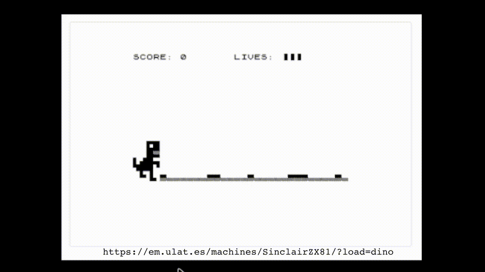
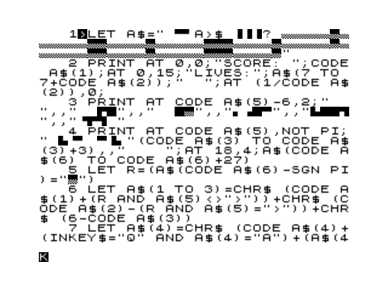
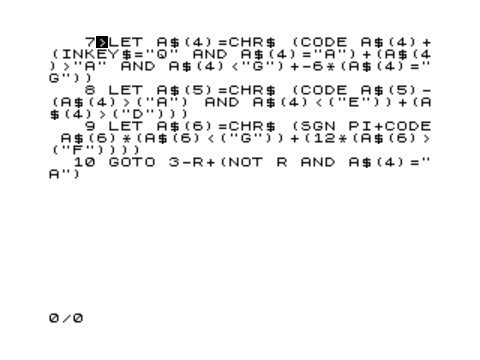
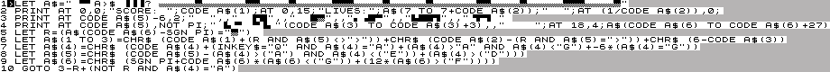

# About

My first entry to the "BASIC 10 Liner" competition, found at https://www.homeputerium.de/

The entry itself is derived from the material in this repo, and at https://bunsen.itch.io/10-line-dino-zx81-by-marquis-de-geek

# BASIC Information

Platform: Sinclair ZX81

Author: Steven Goodwin (aka Marquis de Geek)

Language: Sinclair BASIC

Category: PUR-120

# The Game

10 Line Dino is a minimal version of the "no internet" game, found in Chrome.

You have 3 lives, losing one each time the dino runs into a cactus.

# Installation

* Load the .p file into an emulator (e.g. EightyOne, ZEsarUX)
* Hit 'R' to RUN
* Hit return
* Or run directly from this link,  https://em.ulat.es/machines/SinclairZX81/?load=dino

# The code

The source is available as both [BASIC text](dino-v5.bas) (for converting in zxmakebas) and pre-built [ZX81 dot P file](dino-v5.p)

The visual listing is:

With proof of line length in a, meticulously crafted, image:

# Full explanation

You can read all my 'top of mind' notes in the .bas file above, or read the slightly neated version in [the full description](Description.md)

